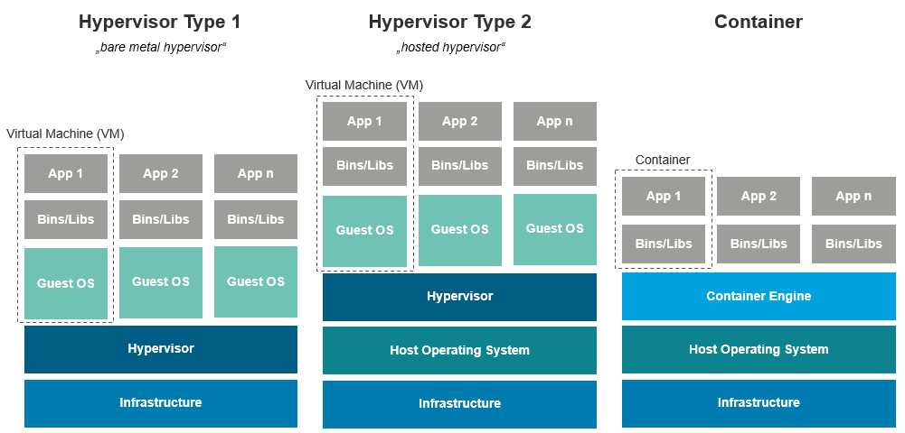
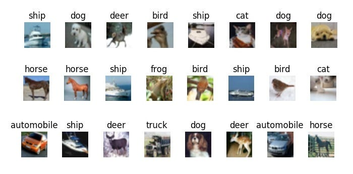
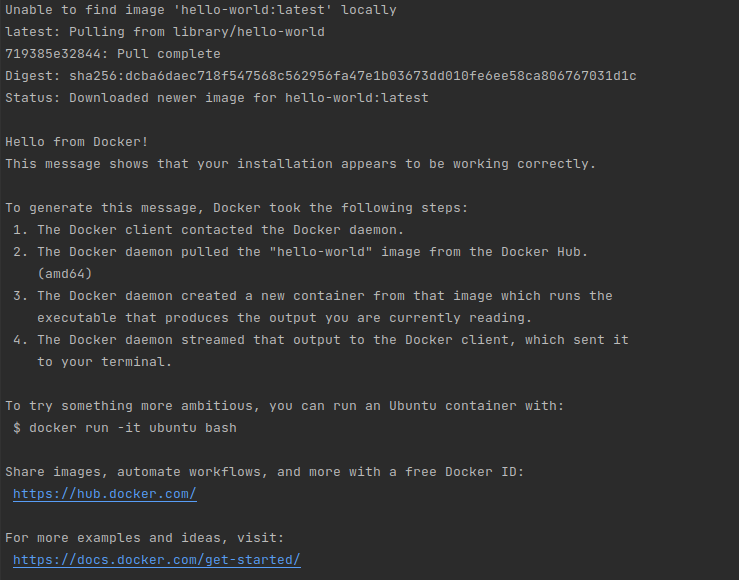
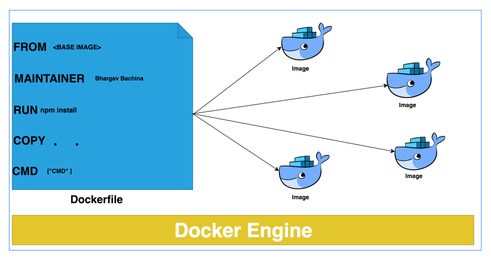
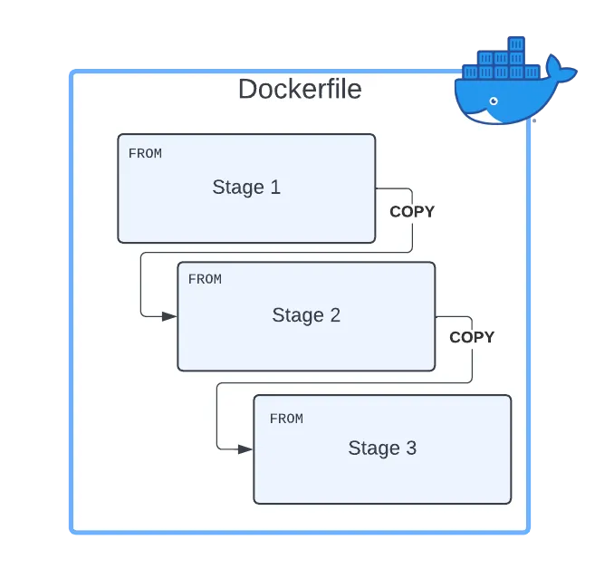
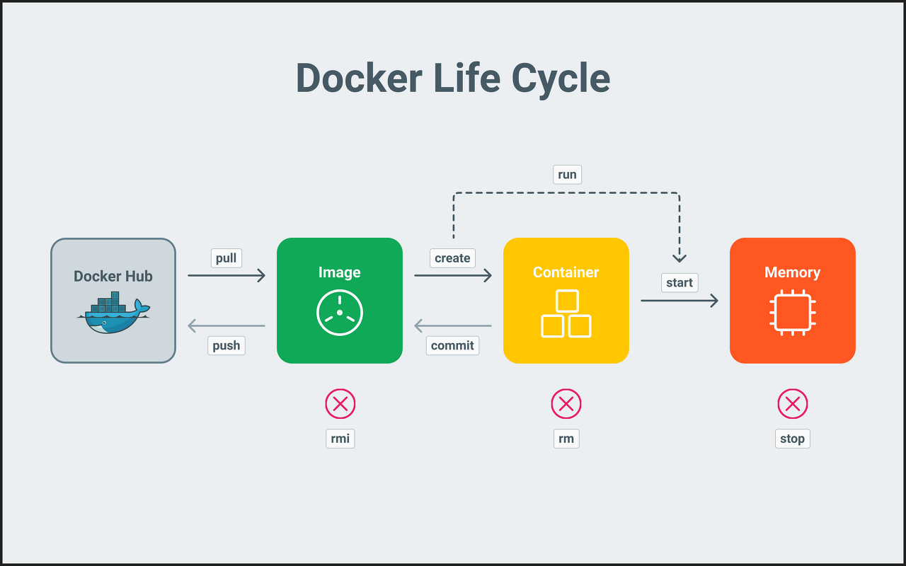
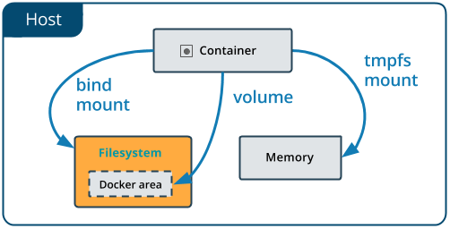

# Docker and AI workship


This workshop will offer a comprehensive overview of Docker's capabilities and demonstrate how Docker images can effectively address dependency challenges often encountered when working with AI libraries. Consider the scenario where you have one model training in PyTorch, which necessitates CUDA 11, and another model training in TensorFlow with a different CUDA dependency. Docker provides a solution to seamlessly abstract and manage these dependencies, ensuring a smooth and efficient workflow for AI development.

### What and why use Docker?

Google prompt: why use docker in AI?
> AI/ML models require a consistent setup and deployment to produce accurate results. Docker allows teams to ensure that their models and environments are identical for each deployment.

> Docker is a powerful platform for building, deploying, and running machine learning and AI applications. It provides a reproducible, portable, isolated, and scalable environment, which can help ensure the accuracy, reliability, and performance of these applications

What is docker?
> Docker is a set of platform as a service (PaaS) products that use OS-level virtualization to deliver software in packages called containers. The service has both free and premium tiers. The software that hosts the containers is called Docker Engine. It was first released in 2013 and is developed by Docker, Inc.
> Docker is a tool that is used to automate the deployment of applications in lightweight containers so that applications can work efficiently in different environments in isolation. 
> 
> Containers are isolated from one another and bundle their own software, libraries and configuration files; they can communicate with each other through well-defined channels. Because all of the containers share the services of a single operating system kernel, they use fewer resources than virtual machines.

Some key-points are: **isolation**, **portable**, **identical** **environment**, **lightweight** and **efficient**



Virtual Machines (VMs) and Docker containers are both technologies used for virtualization and isolation, but they have different approaches and use cases:

Virtual Machine (VM):

1. VMs emulate an entire computer system, including an operating system (OS) and hardware, within a host machine.
    - Each VM runs its own OS, which consumes more resources and makes VMs relatively heavyweight. 
    - VMs provide strong isolation between applications and are suitable for running different OS environments side by side.
    - They are typically slower to start and consume more disk space compared to containers.
2. Docker Container:
    - Containers, like Docker, package an application and its dependencies into a single, lightweight unit, called a container.
    - Containers share the host OS kernel, making them more lightweight and efficient in terms of resource usage compared to VMs.
    - Containers are designed for microservices and application componentization, where multiple containers can run on a single host, enabling rapid deployment and scalability.
    - They are faster to start, use less disk space, and are ideal for deploying and running applications consistently across different environments.

In summary, **VMs** are suitable when you need to run multiple OS environments on a single host with strong **isolation**, while **Docker** containers are preferable for **lightweight**, portable application packaging and deployment**, especially in microservices architectures. The choice between VMs and containers depends on your specific use case and requirements.

## AI project


The AI project involves training and making inferences using a neural network consisting of a 2-layer CNN and a 3-layer Dense network on the CIFAR-10 dataset. All relevant configuration settings, such as the path to download the dataset, the path to store model weights, and hyperparameters, can be located in the 'cifar/config.py' file. For those interested in modifying the model architecture, the 'model.py' file is where the model can be adjusted. Additionally, there are two scripts available: one for training and another for testing. These scripts provide the accuracy of the model across all 10 classes of the CIFAR dataset.




### Hands on Docker.

installation Ubuntu 22.04
```bash
for pkg in docker.io docker-doc docker-compose podman-docker containerd runc; do sudo apt-get remove $pkg; done
sudo apt-get update
sudo apt-get install ca-certificates curl gnupg
sudo install -m 0755 -d /etc/apt/keyrings
curl -fsSL https://download.docker.com/linux/ubuntu/gpg | sudo gpg --dearmor -o /etc/apt/keyrings/docker.gpg
sudo chmod a+r /etc/apt/keyrings/docker.gpg
echo \
  "deb [arch="$(dpkg --print-architecture)" signed-by=/etc/apt/keyrings/docker.gpg] https://download.docker.com/linux/ubuntu \
  "$(. /etc/os-release && echo "$VERSION_CODENAME")" stable" | \
  sudo tee /etc/apt/sources.list.d/docker.list > /dev/null
  
sudo apt-get update

sudo apt-get install docker-ce docker-ce-cli containerd.io docker-buildx-plugin docker-compose-plugin
```

Run Docker and understanding its lifecycle.
```bash
sudo docker run hello-world
```

#### Output from hello-world



1. 'Unable to find image "hello-world:latest"' locally
   - Docker daemon tries to find a docker images in your local machine, if not available it will try to find it at https://www.hub.docker.com. In our case our images can be find [here](https://hub.docker.com/_/hello-world)
2. Docker tags.
   - Docker uses tags to version all it changes. "hello-world:latest" will find the latest stable container. More tags can be found at the tag section in the docker hub.
   - Tags are associated with a push in their CI/CD pipeline.
3. How is the hello-world docker working internally?
   - Docker images are created as a part of CI/CD pipelines.
   - Each tag docker images is generated with a Dockerfile.
   - Dockerfiles contains 4 major steps: FROM, RUN, COPY, CMD or ENTRY 

   
   - Dockerfiles can be nested, creating a hierarchy.

   
   - Repository to hello-world can be found [here](https://github.com/docker-library/hello-world/tree/master/i386/hello-world). Contains a Dockerfile and a binary file. Dockerfile internally contains:
   ```dockerfile
   FROM scratch
   COPY hello /
   CMD ["/hello"]
   ```
4. How do we build such a container?
      Build container
      Cant use absolute path when copying files, easiest way to solve such issues is to execute the build from Dockerfile destination
      ```bash
      cd hello-autoidlabs
      #docker build     -f path_to_dockerfile          . -t container-name:tag
      sudo docker build  . -t hello-lab:kaist
      cd ..
      ```
      Now we search for all available docker containers in our private docker registry.
      
      ```bash
      sudo docker image ls
      ```

| REPOSITORY                          | TAG    | IMAGE ID     | CREATED       | SIZE   |
|-------------------------------------|--------|--------------|---------------|--------|
| hello-lab                           | kaist  | 2bfb50ebdefb | 4 minutes ago | 7.34MB |
| hello-lab                           | ubuntu | afng91f9wmzf | 8 minutes ago | 77.8MB |
| ghcr.io/sdr-enthusiasts/shipxplorer | latest | 443a29e46073 | 7 weeks ago   | 515MB  |
| hello-world                         | latest | 9c7a54a9a43c | 4 months ago  | 13.3kB |

5. How do we run containers?
   - Can run any container that has been build in our private registry or a public registry such as hub.docker.com
   ```bash 
   sudo docker run hello-lab:kaist
   ```
   
### Container lyfecycle

 

Build new container. Same as hello-autoidlabs but: 1. shows the content of out.txt then 2. modifies the content of out.txt

**Question - Will be see AUTO ID LABS or Huni in the new container?**
Build Huni or Autoid?

```bash
cd hello-lifecycle
sudo docker build  . -t huni-or-autoid:latest
cd ..
```

Run Huni or Autoid?

```bash
sudo docker run huni-or-autoid
```

### How can we keep state of our containers? 
Lets say we want to train an AI model using containers. Once we train how do we store the weights of the model?


 

```bash
cd hello-state
sudo docker build  . -t hello-state:latest
cd ..
```

```bash
sudo docker run \
  --volume ${PWD}/hello-state/out:/out \
  hello-state
```

### Install and run project

Install dependencies
```bash
pip install -r requirements.txt
```

Download model
```bash 
python cifar/cifar_data.py
```

Train model
```bash
python cifar/train.py
```

Test model
```bash
python cifar/test.py
```

# Run previous cifar-10 code in container.

We create a container with based on the image pytorch:2.0.1-cuda11.7-cudnn8-devel

This container image is build with next dependencies:
 - pytorch
 - cuda11.7
 - cudnn8
 - Ubuntu22.04
 - python3.8

We mount the src code of our models inside the container, and we execute a script that will read an environment variable to initialize different scripts such as: train, test ...
The data is attached as a volume in the container.

```bash 
cd cifar-docker
sudo docker build  . -t pytorch-generic:latest
cd ..
```

Runs cifar_data.py script and copies data in /data that is mounted to ./data in this repository.
```bash 
sudo docker run \
  --volume ${PWD}/cifar:/code/cifar \
  --volume ${PWD}/mount_dir/data:/data \
  --volume ${PWD}/mount_dir/weights:/weights \
  --env SCRIPT=cifar_data.py \
  --env PATH_DATA=/data \
  pytorch-generic:latest
```

Check now we have the downloaded data in our system ./mount_dir/data

Lets train the model and store our weights.

```bash 
sudo docker run \
  --volume ${PWD}/cifar:/code/cifar \
  --volume ${PWD}/mount_dir/data:/data \
  --volume ${PWD}/mount_dir/weights:/weights \
  --env SCRIPT=train.py \
  --env PATH_DATA=/data \
  --env PATH_WEIGHT=/weights/cifar_net.pth \
  --env EPOCH=10 \
  --env LR=0.001 \
  --env MOMENTUM=0.9 \
  pytorch-generic:latest
```

Last we test
```bash
sudo docker run \
  --volume ${PWD}/cifar:/code/cifar \
  --volume ${PWD}/mount_dir/data:/data \
  --volume ${PWD}/mount_dir/weights:/weights \
  --env SCRIPT=test.py \
  --env PATH_DATA=/data \
  --env PATH_WEIGHT=/weights/cifar_net.pth \
  pytorch-generic:latest
```

Lets say for some reason we need matlibplot 
Lets add manually this into test.py

and run again to see what happens...

```bash
sudo docker run \
  --volume ${PWD}/cifar:/code/cifar \
  --volume ${PWD}/mount_dir/data:/data \
  --volume ${PWD}/mount_dir/weights:/weights \
  --env SCRIPT=test.py \
  --env PATH_DATA=/data \
  --env PATH_WEIGHT=/weights/cifar_net.pth \
  pytorch-generic:latest
```

Error.. missing dependencies.. the main container from pytorch does not add matlibplot into their docker image.. lets add that

```bash 
cd pytorch-matlibplot
sudo docker build  . -t pytorch-matplotlib:latest
cd ..
```

Now we use the new dockerfile we created with matplotlib insalled

```bash
sudo docker run \
  --volume ${PWD}/cifar:/code/cifar \
  --volume ${PWD}/mount_dir/data:/data \
  --volume ${PWD}/mount_dir/weights:/weights \
  --env SCRIPT=test.py \
  --env PATH_DATA=/data \
  --env PATH_WEIGHT=/weights/cifar_net.pth \
  pytorch-matplotlib:latest
```

This cover basics...

Before ending one great utility... Lets run tensorboard in a container without the need to install tensorflow locally


```bash
sudo docker run \
  -p 6006:6006 \
  -v $(pwd)/logs:/logs \
  --name my-tf-tensorboard \
  volnet/tensorflow-tensorboard
```

now we open localhost:6006 and we got tensorflow. Its mapped to `$(pwd)/logs` of our file system.